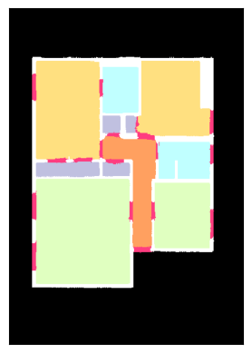

# Floorplan_Colorization

## Overview

This project aims to automatically colorize architectural floorplans using deep learning techniques. By leveraging the power of TensorFlow 2 and a custom neural network architecture, this tool enhances the visual appeal of black-and-white floorplans.




## Installation

To get started with this project, follow these steps:

1. Clone the repository:

   ```bash
   git clone https://github.com/dilip-choudhary1/Floorplan_Colorization.git

2. Open this is google colab and add image url and run it.

